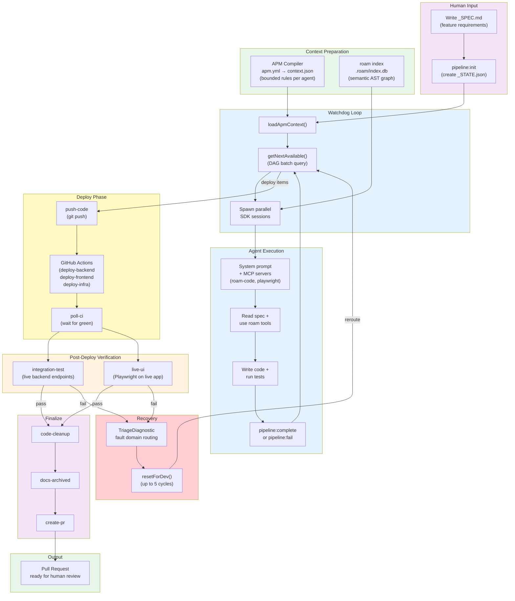

# Autonomous Factory — Deterministic Agentic Coding Pipeline

**TL;DR:** A headless, DAG-scheduled AI coding pipeline that takes a feature spec and delivers a tested Pull Request — 12 specialist agents, self-healing recovery, real browser testing, zero human interaction until code review. I independently converged on the same architectural pattern as [Stripe's Minions](https://stripe.dev/blog/minions-stripes-one-shot-end-to-end-coding-agents-part-2). I believe this pattern — **deterministic orchestration with project-specific agent configuration** — is where enterprise agentic coding is headed. The repo is open. I want your feedback.

**Built for Azure serverless web + microservices** — the sample app deploys Azure Functions (backend), Static Web Apps (frontend), APIM (API gateway), and Terraform (infra). But the engine itself is tech-agnostic: the orchestrator doesn't know what language your code is in or where it deploys. Each app provides its own `.apm/apm.yml` manifest declaring agents, rules, deploy targets, and test commands. Swap Azure Functions for AWS Lambda, Next.js for SvelteKit, TypeScript for Go — the pipeline runs the same.

---

## Quick Start

### 1. Open in DevContainer

This project **requires a DevContainer** — it provides Node.js 22, Python 3.11, Azure CLI, GitHub CLI, Playwright with Chromium, and roam-code pre-installed. All dependencies are installed automatically via `postCreateCommand`.

**VS Code:** Clone the repo → open in VS Code → `Ctrl+Shift+P` → "Dev Containers: Reopen in Container"

**GitHub Codespaces:** Click "Code" → "Codespaces" → "Create codespace on main"

> The DevContainer is configured with `--shm-size=2gb` and `--ipc=host` (required for headless Chromium). See [`.devcontainer/devcontainer.json`](.devcontainer/devcontainer.json) for the full spec.

### 2. Configure CI/CD Environment

The pipeline deploys to Azure and runs live integration tests — GitHub Secrets and Azure OIDC credentials must be configured before running.

**Option A — Let your coding agent do it:**

Paste the following prompt into Claude Code, GitHub Copilot, or any agentic coding tool:

> Configure all GitHub Secrets and Variables needed to run this project's CI/CD pipeline.
>
> **What to read:**
> 1. [`apps/sample-app/infra/dev.tfvars.example`](apps/sample-app/infra/dev.tfvars.example) — Terraform variable template showing which values are needed and how they map to `TF_VAR_*` env vars in CI.
> 2. [`.github/AGENTIC-WORKFLOW.md` — CI/CD Integration section](/.github/AGENTIC-WORKFLOW.md#cicd-integration) — Complete list of all GitHub Secrets, Variables, OIDC setup, and the bootstrap sequence for first-time provisioning.
> 3. [`.github/AGENTIC-WORKFLOW.md` — Linking CI/CD Secrets to APM Config](/.github/AGENTIC-WORKFLOW.md#linking-cicd-secrets-to-apm-config) — Which secrets must stay in sync with `apps/sample-app/.apm/apm.yml`.
> 4. [`.github/workflows/deploy-infra.yml`](.github/workflows/deploy-infra.yml) — Infrastructure deployment workflow (uses `TF_VAR_*` env vars, not var-files).
>
> **What to do:**
> - Run `terraform init` and `terraform apply` locally using `dev.tfvars` (copied from the example) to provision Azure infrastructure.
> - Extract Terraform outputs and set all required GitHub Secrets and Variables using the `gh` CLI.
> - Verify that `apm.yml` URLs and resource names match the configured secrets.

**Option B — Do it manually:**

Follow the [bootstrap sequence](.github/AGENTIC-WORKFLOW.md#bootstrap-sequence-first-time-setup) in `AGENTIC-WORKFLOW.md`. It walks through Terraform provisioning, extracting outputs, and configuring every GitHub Secret and Variable.

### 3. Authenticate and Run

```bash
# Authenticate (inside DevContainer)
gh auth login
az login

# Create a feature spec
mkdir -p apps/sample-app/in-progress
vim apps/sample-app/in-progress/my-feature_SPEC.md

# Initialize pipeline state
export APP_ROOT=apps/sample-app
npm run pipeline:init my-feature Full-Stack

# Run the orchestrator
npm run agent:run -- --app apps/sample-app my-feature

# Review the PR when the pipeline completes
```

### Prerequisites

- **DevContainer:** Required — see step 1 above
- **CI/CD configured:** GitHub Secrets and Azure OIDC credentials — see step 2 above
- **GitHub CLI auth:** `gh auth status` must show a valid token
- **Azure CLI auth:** `az account show` must succeed (for live deploy/test phases)
- **App config:** `apps/sample-app/.apm/apm.yml` must exist — URLs and Azure resource names must match GitHub secrets ([linking table](.github/AGENTIC-WORKFLOW.md#linking-cicd-secrets-to-apm-config))

### Adapting for Your Project

1. Copy `apps/sample-app/` to `apps/your-app/`
2. Edit `.apm/apm.yml` — update URLs, Azure resource names, agent instructions
3. Write your instruction fragments in `.apm/instructions/` (backend rules, frontend rules, etc.)
4. Point CI workflows at your app path
5. Run `npm run agent:run -- --app apps/your-app my-feature`

### Sample App Authentication (Dual-Mode)

The sample app ships with a **dual-mode auth system** — demo credentials and Entra ID — controlled by a single env var (`AUTH_MODE` / `NEXT_PUBLIC_AUTH_MODE`).

| Mode | Purpose | When to Use |
|------|---------|-------------|
| **`demo`** | Shared credentials (`demo` / `demopass`) with token-based auth | **Required for the pipeline.** The `integration-test` and `live-ui` agents use demo credentials to authenticate E2E tests against the deployed app without Entra ID configuration. |
| **`entra`** | Entra ID (Azure AD) with MSAL redirect and JWT validation | **Production.** Real SSO with enterprise identity. Switch when deploying for real users. |

**Why demo mode exists:** The agentic pipeline needs to run post-deploy verification (integration tests + Playwright E2E) against a live, authenticated app. Demo mode provides deterministic credentials that agents can use without Azure AD tenant configuration — making the pipeline runnable out of the box.

**Switching modes:**
1. Set `auth_mode = "entra"` in `apps/sample-app/infra/dev.tfvars` and run `terraform apply`
2. Set `NEXT_PUBLIC_AUTH_MODE=entra` + Entra ID client/tenant IDs in the frontend env
3. APIM policies automatically switch from `check-header` (demo token) to `validate-jwt` (Bearer JWT)

See [infra/README.md](apps/sample-app/infra/README.md) for the full switching procedure and defense-in-depth auth chain.

---

## Architecture

The system separates two concerns that most agentic tools conflate:

- **Control plane (deterministic)** — A TypeScript `while` loop reads a DAG state machine, resolves dependencies, and spawns agent sessions. No LLM decides what happens next.
- **Execution plane (LLM)** — Each specialist agent receives a bounded context (rules, MCP tools, skills) and reasons about its domain. Trusted to *think*, not to *orchestrate*.



When post-deploy verification fails, the pipeline doesn't stop — it triages the failure, resets the right agents, and loops back. Bounded by circuit breakers (5 redevelopment cycles, 10 retries per item, session timeouts).

**CI/CD is not optional.** The Deploy and Post-Deploy phases push code to Azure (Functions, Static Web Apps, APIM) via 6 GitHub Actions workflows, then run live integration tests and Playwright E2E against the deployed infrastructure. Without configured [GitHub Secrets and OIDC credentials](.github/AGENTIC-WORKFLOW.md#cicd-integration), the pipeline halts at `push-code`.

---

## Key Capabilities

1. **DAG-Scheduled Parallel Execution** — 12 pipeline items across 4 phases, scheduled by an explicit dependency graph. Independent agents fire concurrently. Full-stack features complete in ~6 batches instead of 12 serial steps. Four workflow types (`Backend`, `Frontend`, `Full-Stack`, `Infra`) prune irrelevant items at init.
   → *Deep dive: [04-state-machine.md](tools/autonomous-factory/docs/04-state-machine.md)*

2. **APM: Agent Package Manager** — Each agent receives *only* the rules relevant to its domain from modular `.md` instruction fragments. Token budget enforcement (`6,000 tokens`) prevents context degradation as rules grow. Built on [Microsoft's APM](https://github.com/microsoft/apm) standard.
   → *Deep dive: [03-apm-context.md](tools/autonomous-factory/docs/03-apm-context.md)*

3. **Self-Healing Recovery Loop** — Post-deploy test failures produce a structured `TriageDiagnostic` with fault domain routing. The triage engine resets only the responsible dev agents and injects error context into their next prompt. Circuit breakers prevent infinite loops.
   → *Deep dive: [01-watchdog.md](tools/autonomous-factory/docs/01-watchdog.md)*

4. **Real Browser Testing** — The `live-ui` agent creates Playwright E2E scenarios and runs them with headless Chromium against the deployed app. It authenticates through demo credentials (`demo` / `demopass`) programmatically, validates CORS, routing, and rendered DOM. `integration-test` validates live backend endpoints with schema verification. Demo auth mode is required for these agents to run without Entra ID configuration.
   → *Deep dive: [05-agents.md](tools/autonomous-factory/docs/05-agents.md)*

5. **Structural Code Intelligence (Roam-Code)** — [roam-code](https://github.com/Cranot/roam-code) pre-indexes the codebase into a semantic AST graph (tree-sitter, 27 languages, 102 MCP tools). Agents query the graph for call relationships, blast radius analysis, and test coverage — replacing text search with structural guarantees. ~5x fewer tokens consumed.
   → *Deep dive: [02-roam-code.md](tools/autonomous-factory/docs/02-roam-code.md)*

6. **Deterministic Safety** — Agents cannot run raw git commands, edit state files, or skip phases. Every side-effect goes through deterministic wrappers (`agent-commit.sh`, `agent-branch.sh`, `pipeline:complete`). Constitutional hard limits enforce boundaries the LLM cannot override.

7. **Execution Audit Trail** — Every run produces `_SUMMARY.md` (per-step metrics), `_TERMINAL-LOG.md` (timestamped trace), `_PLAYWRIGHT-LOG.md` (browser actions), and `_CHANGES.json` (structured change manifest). All archived to `archive/features/<slug>/`.

8. **Platform Portability** — The engine (`tools/autonomous-factory/`) is app-agnostic. Point `--app` at any directory with an `.apm/apm.yml` manifest. Same engine, different projects, independent governance rules.

→ *Full system architecture: [00-overview.md](tools/autonomous-factory/docs/00-overview.md)*

---

## Independent Convergence with Stripe's Minions

Stripe's Minions produce **1,300+ PRs per week** with zero human-written code. The architecture is strikingly similar:

| Design Decision | This Pipeline | Stripe Minions |
|-----------------|:-----------:|:--------------:|
| **Orchestration** | Deterministic TypeScript loop with DAG state machine | "Blueprints" — state machines with interwoven deterministic and agentic nodes |
| **Agent specialization** | 12 domain-specific agents with per-agent prompts | Task-specific agents with curated tool subsets |
| **Context management** | APM compiler with token budgets + modular rules | Scoped rules (Cursor format) + MCP tools via "Toolshed" (~500 tools) |
| **CI integration** | Push → poll CI → auto-fix → re-push (bounded cycles) | Push → CI run → autofix → agent fix → second CI run (bounded to 2 iterations) |
| **Failure recovery** | Structured triage → fault domain → targeted reroute | CI failures route back to agent nodes for local remediation |
| **Safety boundary** | Circuit breakers: 10 retries, 5 reroute cycles, session timeouts | 2 CI iteration limit; quarantined devboxes with no production access |
| **Per-project config** | `.apm/apm.yml` per app (agents, rules, MCP, skills, budgets) | Per-codebase rule files + per-user tool configurations |

> Two teams, working independently, arrived at the same pattern: **deterministic orchestration wrapping LLM execution, configured per project, with bounded failure recovery and CI/CD as a first-class pipeline phase.**

---

## This Pipeline vs. Claude Code Agent Teams

These are **complementary, not competing**. Use Agent Teams to explore a problem space — then feed findings into a spec and run this pipeline to execute deterministically.

| Dimension | This Pipeline | Claude Code Agent Teams |
|-----------|:---:|:---:|
| **Orchestration** | Deterministic (code decides) | LLM-based (Claude decides) |
| **State persistence** | JSON state file — survives crashes | In-memory — no session resume |
| **Failure recovery** | Structured triage + circuit breakers | Lead must notice and redirect |
| **CI/CD** | 6 native GitHub Actions workflows | None built-in |
| **Context management** | Per-agent token budgets | Uniform context for all teammates |
| **Reproducibility** | Same spec → same execution path | Non-deterministic decomposition |
| **Setup** | High (manifest + rules + CI workflows) | One env var |
| **Best for** | Autonomous feature delivery | Collaborative exploration |

---

## The 80/20 Thesis

**80% of software engineering work** — the well-understood, pattern-following, test-definable work — will be handled by **deterministic pipelines configured per project**. **20%** — the conceptual design, architectural decisions, ambiguous requirements — stays with human engineers.

Stripe's Minions validate this at massive scale. This pipeline validates it at the architecture level — proving the pattern works with open tooling (GitHub Actions, Copilot SDK, Playwright, Terraform).

---

## What's Next

- **Near-term:** Extract Azure-specific rules into pluggable "stack packs" — core engine ships clean
- **Mid-term:** Cloud-hosted parallel execution — multiple features on separate branches with automatic conflict resolution
- **Long-term:** Pipeline analytics from execution logs — which rules cause recovery cycles, which agents burn tokens, which features struggle

---

## Documentation

| Document | What It Covers |
|----------|---------------|
| [AGENTIC-WORKFLOW.md](.github/AGENTIC-WORKFLOW.md) | Operational hub — project structure, config, commands, safety guardrails, how to run |
| [CI/CD Integration](.github/AGENTIC-WORKFLOW.md#cicd-integration) | GitHub Secrets, Azure OIDC setup, secret↔apm.yml linking, bootstrap sequence |
| [00-overview.md](tools/autonomous-factory/docs/00-overview.md) | Full system architecture, component map, tech stack |
| [01-watchdog.md](tools/autonomous-factory/docs/01-watchdog.md) | Orchestrator loop, session lifecycle, failure recovery |
| [02-roam-code.md](tools/autonomous-factory/docs/02-roam-code.md) | Roam-code: capabilities, integration, agent rules, adoption roadmap |
| [03-apm-context.md](tools/autonomous-factory/docs/03-apm-context.md) | APM manifest, rule resolution, token budgets |
| [04-state-machine.md](tools/autonomous-factory/docs/04-state-machine.md) | Pipeline DAG, workflow types, redevelopment reroute |
| [05-agents.md](tools/autonomous-factory/docs/05-agents.md) | 12 specialist agents, MCP assignments, prompt anatomy |

---

**Stack:** TypeScript, @github/copilot-sdk, GitHub Actions, Playwright, Terraform, roam-code, Zod

#AgenticCoding #DeveloperTools #AIEngineering #DevOps #SystemsArchitecture #OpenSource
