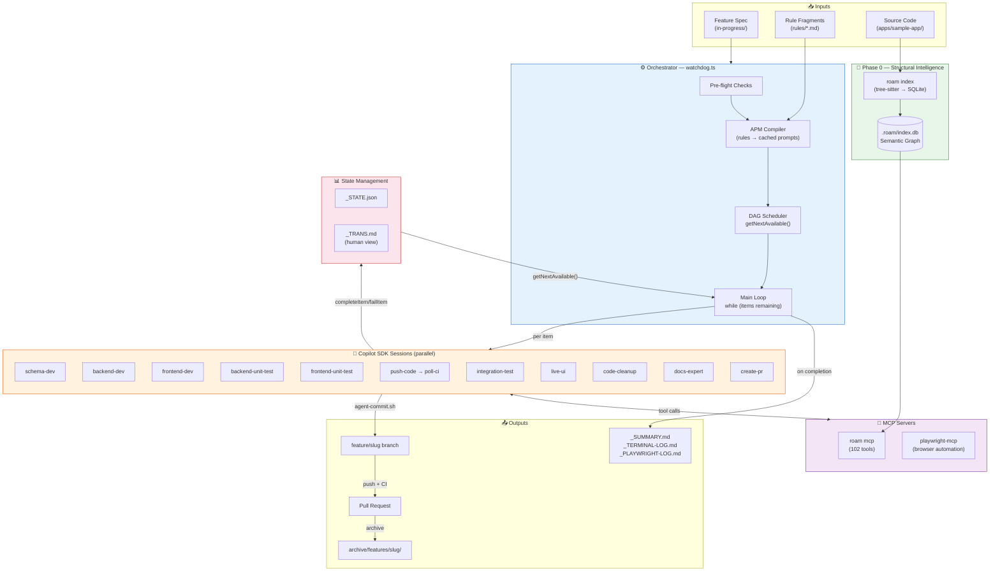
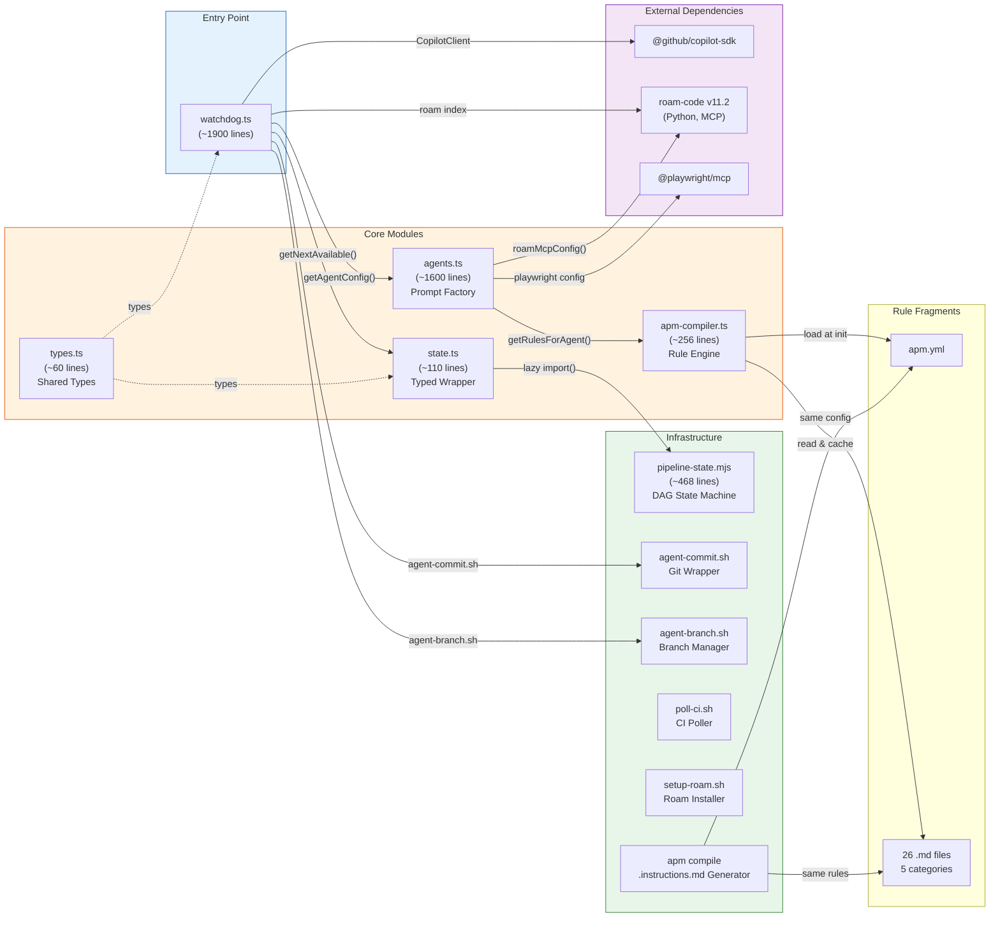
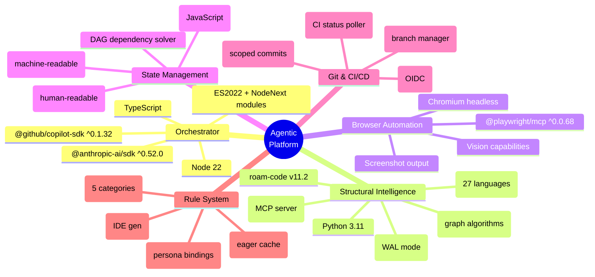
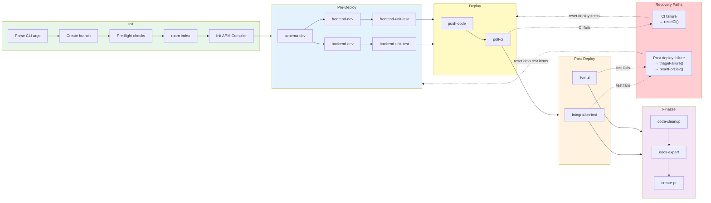
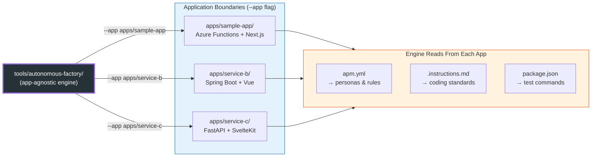

# System Overview — Autonomous Agentic Coding Platform

> Visual-first architecture reference. Diagrams carry the information; text is captions only.

---

## Full System Architecture

---

## Component Relationship Map

---

## Technology Stack

---

## Pipeline Execution Flow (End-to-End)

---

## Platform Portability — App-Agnostic Engine

> **Scaling insight:** `tools/autonomous-factory/` is a standalone compiler engine. It does not know what a "React App" or an "Azure Function" is. It receives a `--app` boundary path, reads that app's `apm.yml` to discover personas and rules, and executes. A single deployment of this engine could build 50 microservices in 5 languages simultaneously — each with its own governance rules, each isolated by the `appRoot` / `repoRoot` boundary.

> Full competitive analysis and project narrative: [README.md](../../README.md)

---

## Documentation Map

| # | Document | What It Covers |
|---|----------|---------------|
| **00** | **This file** | System-level architecture, component relationships, tech stack |
| **01** | [01-watchdog.md](01-watchdog.md) | Orchestrator main loop, session lifecycle, failure recovery, timeouts |
| **02** | [02-roam-code.md](02-roam-code.md) | Roam-code: 6 killer capabilities, integration, agent rules, adoption roadmap |
| **03** | [03-apm-context.md](03-apm-context.md) | Rule resolution pipeline, persona mapping, token budgets |
| **04** | [04-state-machine.md](04-state-machine.md) | Pipeline DAG, workflow types, status lifecycle, redevelopment reroute |
| **05** | [05-agents.md](05-agents.md) | 12 specialist agents, MCP assignments, prompt anatomy, auto-skip |

**Operational hub:** [`.github/AGENTIC-WORKFLOW.md`](../../.github/AGENTIC-WORKFLOW.md) — project structure, configuration, commands, safety guardrails, and how to run.
