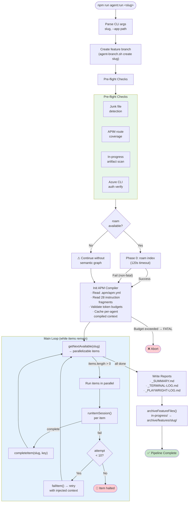
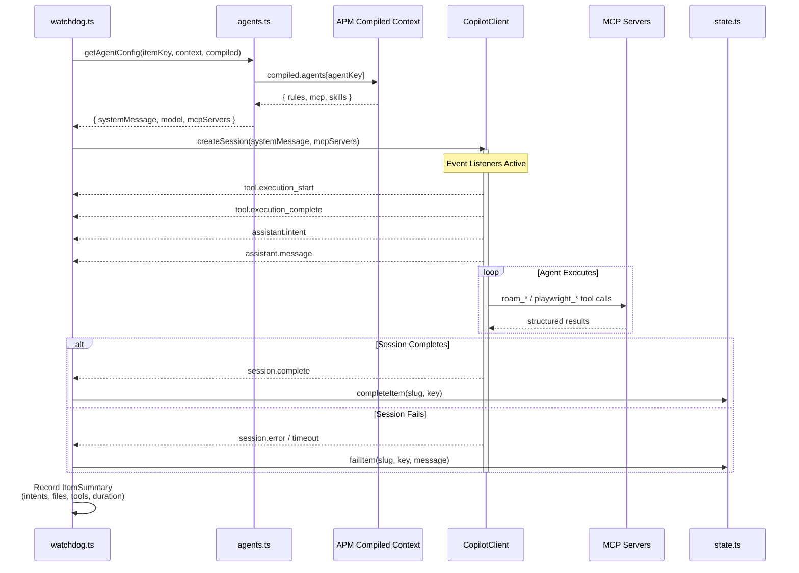
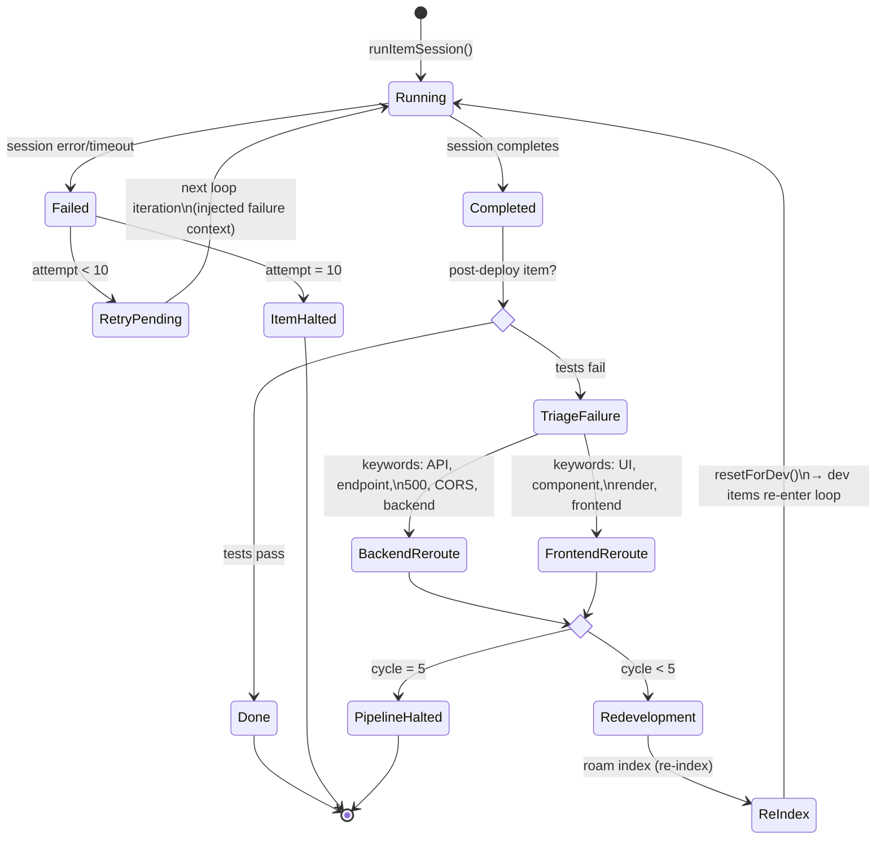
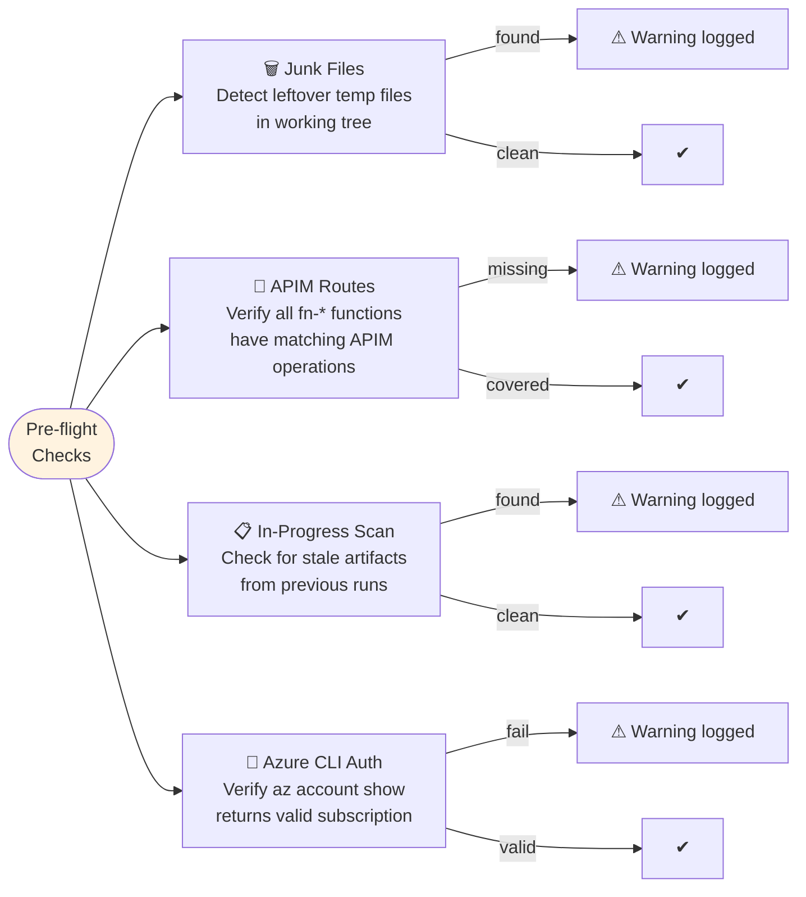
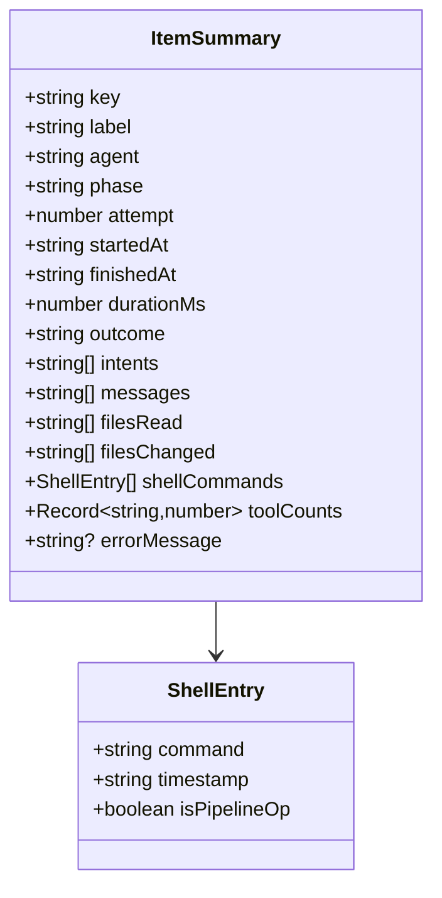

# Orchestrator — watchdog.ts

> The deterministic headless loop that drives the entire pipeline.
> Source: `tools/autonomous-factory/src/watchdog.ts` (~1900 lines)
> Hub: [AGENTIC-WORKFLOW.md](../../.github/AGENTIC-WORKFLOW.md)

---

## Main Loop Flowchart

---

## Session Lifecycle

---

## Failure Recovery State Machine

---

## Session Timeout Configuration

| Item Type | Timeout | Rationale |
|-----------|---------|-----------|
| **Dev items** (schema-dev, backend-dev, frontend-dev) | 20 min | Complex implementation, multi-file changes |
| **Test items** (backend-unit-test, frontend-unit-test) | 10 min | Scoped to test writing, fewer files |
| **Deploy items** (push-code, poll-ci) | 30 min | CI polling waits for external workflows |
| **Post-deploy items** (integration-test, live-ui) | 15 min | Run against live endpoints, may need retries |
| **Finalize items** (code-cleanup, docs-expert, create-pr) | 15 min | Scoped cleanup and documentation tasks |

---

## Pre-flight Checks Detail

> All pre-flight checks are **non-fatal** — failures are logged as warnings and the pipeline continues.

---

## Reporting Outputs

| Report | File | Content |
|--------|------|---------|
| **Pipeline Summary** | `_SUMMARY.md` | Phase-grouped results, per-step metrics, tool counts, intents, duration |
| **Terminal Log** | `_TERMINAL-LOG.md` | Chronological events: shell commands, file ops, intents with timestamps |
| **Playwright Log** | `_PLAYWRIGHT-LOG.md` | Structured Playwright tool calls with args and results (live-ui phase only) |

All reports saved to `in-progress/<slug>_*.md` before archiving to `archive/features/<slug>/`.

---

## Key Data Structures

---

## Key Functions Reference

| Function | Purpose | Called By |
|----------|---------|----------|
| `main()` | Entry point — init, pre-flight, Phase 0, main loop | CLI |
| `runItemSession()` | Execute one pipeline item in a Copilot SDK session | Main loop |
| `triageFailure()` | Keyword-based routing of post-deploy failures to dev items | Main loop |
| `getTimeout()` | Session timeout by item type | `runItemSession()` |
| `getAutoSkipBaseRef()` | Git ref for change detection (auto-skip optimization) | Main loop |
| `getGitChangedFiles()` | Files changed since a git ref via `git diff --name-only` | Auto-skip |
| `writePipelineSummary()` | Generate `_SUMMARY.md` | Post-loop |
| `writeTerminalLog()` | Generate `_TERMINAL-LOG.md` | Post-loop |
| `writePlaywrightLog()` | Generate `_PLAYWRIGHT-LOG.md` | Post-loop |
| `archiveFeatureFiles()` | Move `in-progress/` → `archive/features/slug/` | After create-pr |

---

*← [00 Overview](00-overview.md) · [02 Roam-Code →](02-roam-code.md)*
