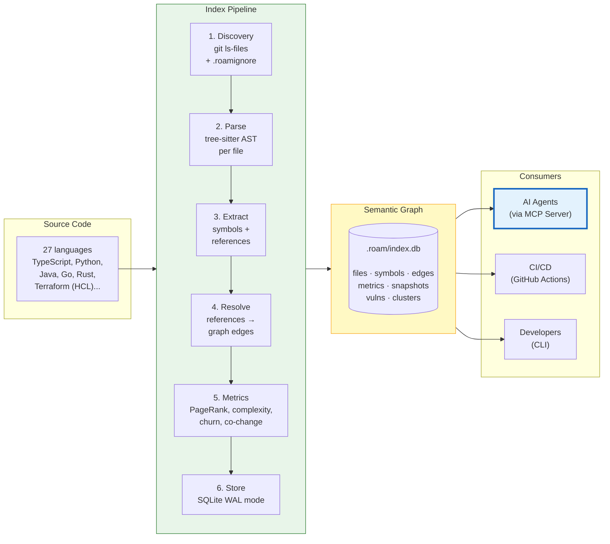
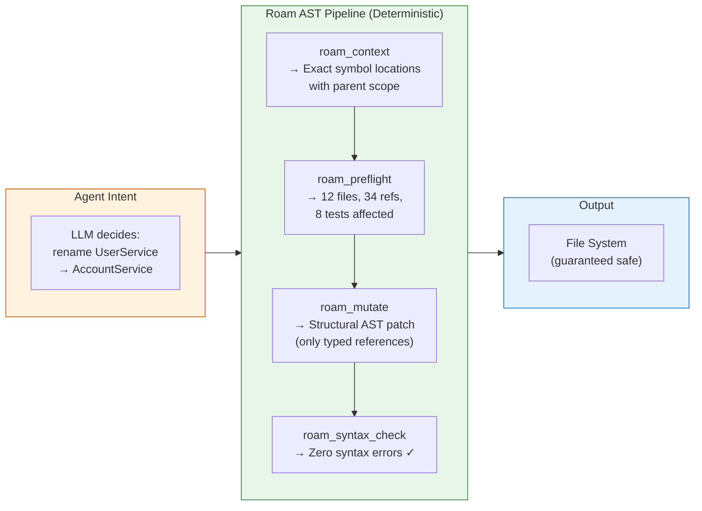
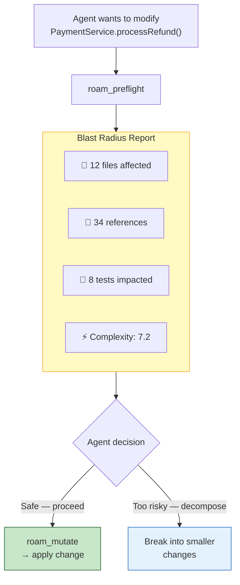
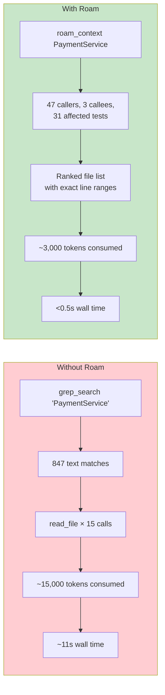
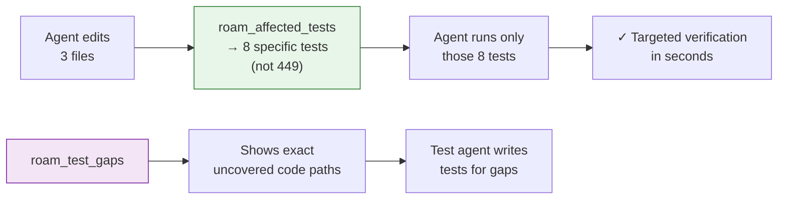
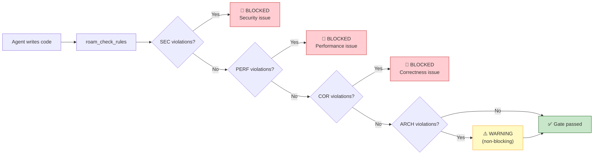
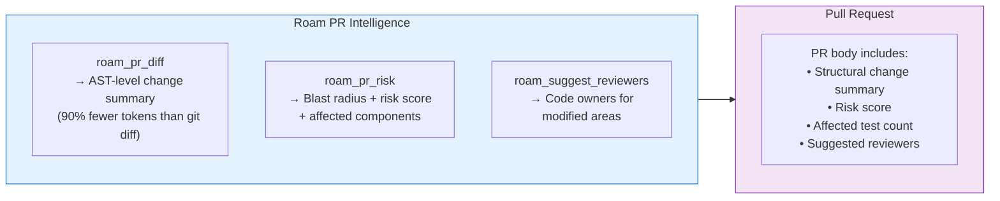
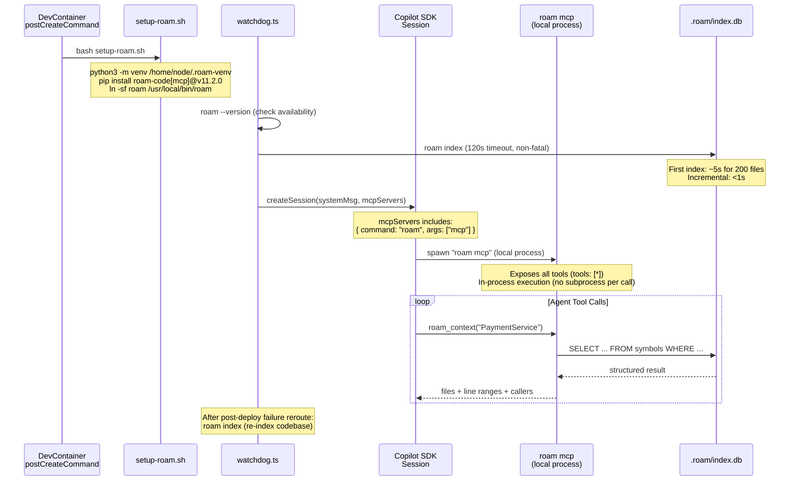
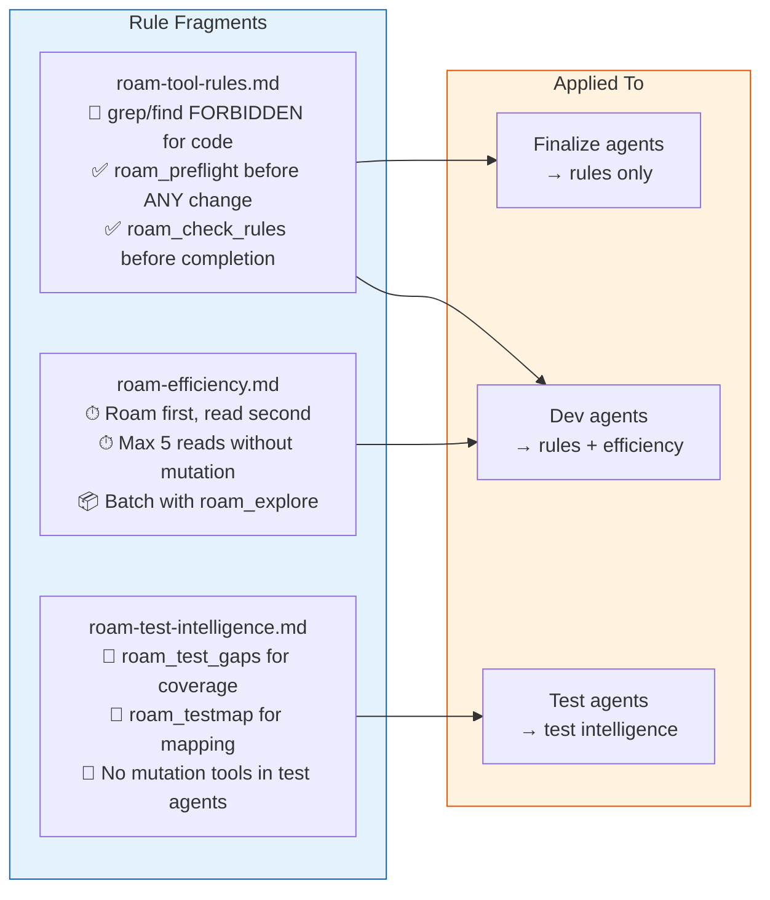
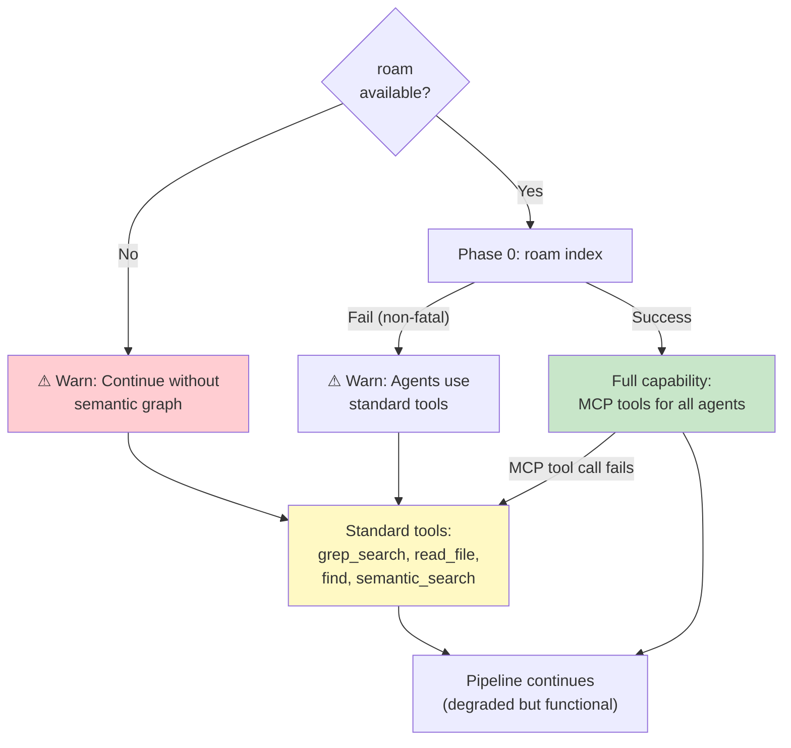

# Roam-Code — Structural Intelligence Engine

> The AST engine that makes autonomous code mutation safe, fast, and governable.
> roam-code v11.2 · [github.com/Cranot/roam-code](https://github.com/Cranot/roam-code) · Installed via `tools/autonomous-factory/setup-roam.sh`
> Hub: [AGENTIC-WORKFLOW.md](../../.github/AGENTIC-WORKFLOW.md)

---

## What Roam-Code Does (One Diagram)

---

## Killer Capabilities — What Roam Enables for Our Pipeline

### 1. Safe Code Mutation — Agents Can't Corrupt Your Codebase

Standard AI agents use `sed`, `grep`, or string replacement to edit code. At monorepo scale, this causes silent corruption — a rename hits comments, strings, and unrelated symbols. Our agents are **physically prevented** from string-mutating code. Instead, they go through a deterministic AST pipeline:

> The LLM never touches the file system directly. Every code change flows through AST-level mutation with syntax verification — silent corruption is structurally impossible.

### 2. Blast Radius Visibility — Know the Impact Before Any Change

Before an agent modifies a single line, `roam_preflight` calculates the full downstream impact. This turns "hope it works" into deterministic impact analysis:

> Every agent prompt includes a hard rule: **no code change without a preflight**. The blast radius is visible before the change happens.

### 3. 5× Cheaper, 22× Faster Code Comprehension

When an agent needs to understand a symbol, the difference between grep and roam is dramatic:

| Metric | grep/read approach | roam approach | Improvement |
|--------|-------------------|---------------|-------------|
| Tool calls | 8 | 1 | **8× fewer** |
| Wall time | ~11s | <0.5s | **22× faster** |
| Tokens consumed | ~15,000 | ~3,000 | **5× cheaper** |
| Structural understanding | None | Full dependency graph | **Qualitative leap** |

> Over a full-stack feature with 12 agents, roam saves tens of thousands of tokens and minutes of wall time per pipeline run.

### 4. Test Intelligence — Only Run What Matters

After code changes, agents don't blindly run the full test suite. Roam tells them exactly which tests are affected:

> `roam_affected_tests` maps code changes to specific test files. `roam_test_gaps` shows the test agent exactly which code paths lack coverage — no guessing.

### 5. Automated Governance Gate — Code Quality Enforcement

Every agent must pass a `roam_check_rules` gate before declaring completion. Violations in blocking categories halt the pipeline:

> SEC, PERF, and COR violations are **blocking** — the agent must fix the issue before proceeding. ARCH violations are warnings. This is enforced by rule fragments, not agent goodwill.

### 6. PR Risk Scoring — Quantified Risk Before Merge

When the `create-pr` agent assembles the Pull Request, roam provides a structural risk assessment:

> The human reviewer sees a **quantified risk assessment** — not just a code diff, but which components are affected, what the blast radius is, and who should review.

---

## How We Integrate Roam

---

## Agent Rule System

Three rule fragments govern how agents use roam — enforced via the Prompt Assembler, not agent discretion:

> Key enforcement: agents are **forbidden** from using `grep_search`, `find`, `fd`, `ag`, `rg`, or `ls -R` for code exploration. All code comprehension goes through roam. The only exception: `grep` for non-code files (markdown, config, JSON).

---

## Performance

| Operation | Time | Notes |
|-----------|------|-------|
| Index 200 files | ~3–5s | First run |
| Index 3,000 files | ~2 min | First run |
| Incremental index | <1s | SHA-256 hash + mtime check |
| Any query command | <0.5s | SQLite FTS5/BM25 |
| MCP tool call | <0.5s | In-process (no subprocess per call) |

---

## Graceful Degradation

> Roam is a **force multiplier**, not a hard dependency. The pipeline runs without it — just slower and less precise.

---

## Reference

### Actively Used Tools (25 of 102)

| Phase | Tools |
|-------|-------|
| **Exploration** | `roam_understand`, `roam_context`, `roam_search_symbol`, `roam_explore` |
| **Pre-change** | `roam_preflight`, `roam_prepare_change` |
| **Post-change** | `roam_review_change`, `roam_affected_tests`, `roam_check_rules`, `roam_syntax_check` |
| **Mutation** | `roam_mutate`, `roam_safe_delete`, `roam_semantic_diff` |
| **Testing** | `roam_test_gaps`, `roam_testmap` |
| **Cleanup** | `roam_flag_dead`, `roam_orphan_routes`, `roam_dark_matter` |
| **PR creation** | `roam_pr_diff`, `roam_pr_risk`, `roam_suggest_reviewers`, `roam_doc_staleness`, `roam_index` |

Full 102-tool inventory: `roam mcp --list-tools`

### Adoption Roadmap — High-Priority Unused Tools

| Tool | Impact | Priority | Where |
|------|--------|----------|-------|
| `roam_health` | Quantified quality gate (0–100 score) | **P1** | push-code pre-check |
| `roam_verify_imports` | Catches hallucinated imports in agent code | **P1** | post-change rules |
| `roam_diagnose_issue` | Structural root cause (replaces keyword triage) | **P1** | watchdog.ts |
| `roam_algo` | 23 anti-pattern detectors (O(n²), N+1) | **P2** | code-cleanup agent |
| `roam_secrets` | Secret leakage scan | **P2** | pre-flight checks |
| `roam_clones` | AST clone detection (dedup agent code) | **P2** | code-cleanup agent |
| `roam_api_changes` | Breaking API risk detection | **P2** | schema-dev gate |

### MCP Preset System

Current config: `tools: ["*"]` (full preset — all 102 tools exposed). Roam supports progressive presets (`core` → `review` → `refactor` → `debug` → `architecture` → `full`) with a `roam_expand_toolset` meta-tool for on-demand expansion. Consider restricting to `core` preset to reduce token overhead from schema enumeration.

### Installation

| Aspect | Value |
|--------|-------|
| Version | v11.2.0 (pinned) |
| Python | 3.11 · venv at `/home/node/.roam-venv` |
| Binary | symlinked to `/usr/local/bin/roam` |
| Index | `.roam/index.db` (git-ignored) |
| MCP launch | `roam mcp` as local process via `roamMcpConfig()` |

### Language Support

27 languages via tree-sitter. **Current deployment uses TypeScript, Python, and Terraform HCL.** Full Tier 1 support (dedicated parsers with symbol extraction and edge types): TypeScript, JavaScript, Python, Java, Go, Rust, C/C++, C#, HCL/Terraform, YAML, PHP, Ruby, Kotlin, Scala, SQL, Swift, Vue, Svelte.

---

*← [01 Watchdog](01-watchdog.md) · [03 APM Context →](03-apm-context.md)*
