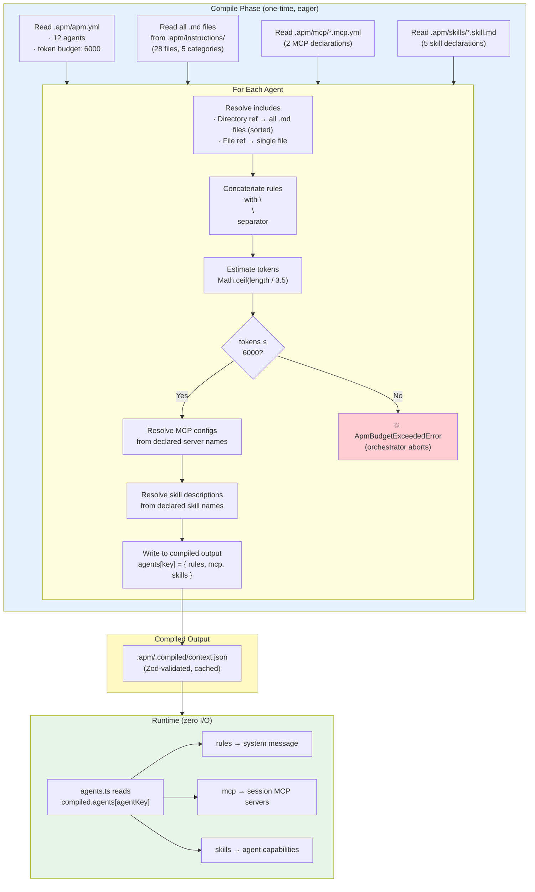
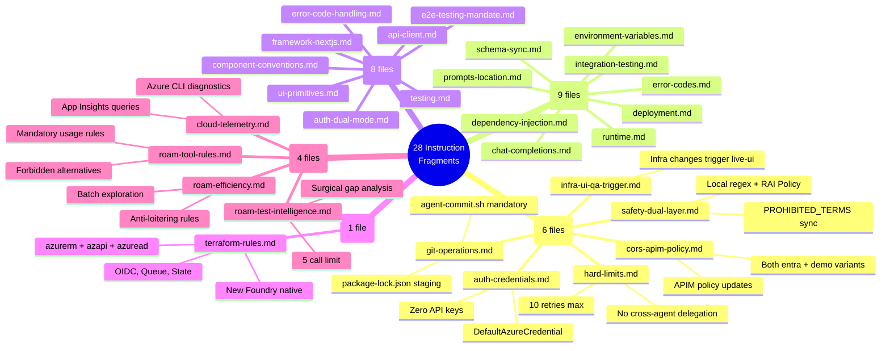
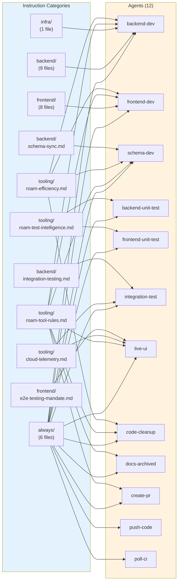
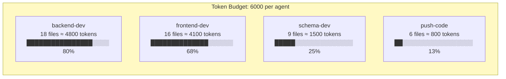
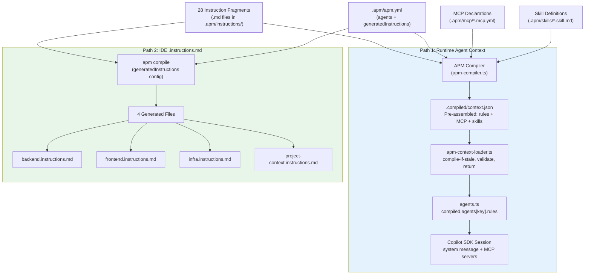
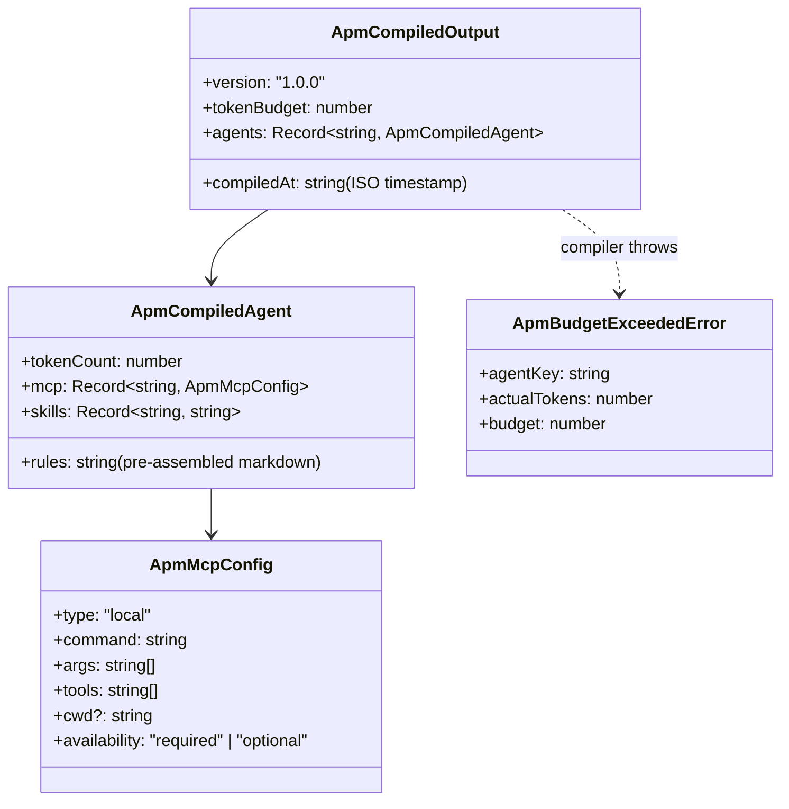

# APM Context System — Dynamic Rule Engine

> Loads coding rule fragments at startup, assembles per-agent prompts, validates token budgets eagerly.
> Source: `tools/autonomous-factory/src/apm-compiler.ts` + `apm-context-loader.ts` + `apm-types.ts`
> Hub: [AGENTIC-WORKFLOW.md](../../.github/AGENTIC-WORKFLOW.md)

---

## How It Works (End-to-End)



---

## APM Manifest (`apm.yml`)

The APM manifest is the **single source of truth** for context delivery. It lives at `<appRoot>/.apm/apm.yml` and declares:

| Field | Purpose |
|-------|---------|
| `name` | App identifier |
| `version` | Semantic version for the context contract |
| `tokenBudget` | Max estimated tokens per agent's assembled instructions |
| `agents` | Maps each agent key to its instruction includes, MCP servers, and skills |
| `generatedInstructions` | IDE `.instructions.md` files to generate via `apm compile` |

```yaml
# Example from sample-app
name: sample-app
version: 1.0.0
tokenBudget: 6000

agents:
  backend-dev:
    instructions: [always, backend, infra, tooling/roam-tool-rules.md, tooling/roam-efficiency.md]
    mcp: [roam-code]
    skills: [test-backend-unit, test-schema-validation]
  frontend-dev:
    instructions: [always, frontend, tooling/roam-tool-rules.md, tooling/roam-efficiency.md]
    mcp: [roam-code]
    skills: [test-frontend-unit, build-frontend]
  # ... 10 more agents
```

---

## Directory Structure

```
apps/<app>/.apm/
  apm.yml                     # Root manifest (context SSOT)
  instructions/               # Rule fragments (28 .md files)
    always/                   # Injected into ALL agents
    backend/                  # Backend-specific rules
    frontend/                 # Frontend-specific rules
    infra/                    # Terraform/Azure rules
    tooling/                  # Roam, telemetry, test intelligence
  mcp/                        # MCP server declarations
    roam-code.mcp.yml
    playwright.mcp.yml
  skills/                     # Capability definitions
    test-backend-unit.skill.md
    test-frontend-unit.skill.md
    test-integration.skill.md
    test-schema-validation.skill.md
    build-frontend.skill.md
  .compiled/                  # Generated output (gitignored)
    context.json
```

---

## Instruction Fragment Inventory



---

## Agent → Instruction Mapping



### Detailed Include Map

| Agent | Includes | Files Loaded |
|-------|----------|-------------|
| `backend-dev` | `always`, `backend`, `infra`, `tooling/roam-tool-rules.md`, `tooling/roam-efficiency.md` | 6 + 9 + 1 + 1 + 1 = **18** |
| `frontend-dev` | `always`, `frontend`, `tooling/roam-tool-rules.md`, `tooling/roam-efficiency.md` | 6 + 8 + 1 + 1 = **16** |
| `schema-dev` | `always`, `backend/schema-sync.md`, `tooling/roam-tool-rules.md`, `tooling/roam-efficiency.md` | 6 + 1 + 1 + 1 = **9** |
| `backend-unit-test` | `always`, `tooling/roam-test-intelligence.md` | 6 + 1 = **7** |
| `frontend-unit-test` | `always`, `tooling/roam-test-intelligence.md` | 6 + 1 = **7** |
| `integration-test` | `always`, `backend/integration-testing.md`, `tooling/cloud-telemetry.md` | 6 + 1 + 1 = **8** |
| `live-ui` | `always`, `frontend/e2e-testing-mandate.md`, `tooling/roam-tool-rules.md`, `tooling/cloud-telemetry.md` | 6 + 1 + 1 + 1 = **9** |
| `code-cleanup` | `always`, `tooling/roam-tool-rules.md`, `tooling/roam-efficiency.md` | 6 + 1 + 1 = **8** |
| `docs-archived` | `always`, `tooling/roam-tool-rules.md` | 6 + 1 = **7** |
| `create-pr` | `always`, `tooling/roam-tool-rules.md` | 6 + 1 = **7** |
| `push-code` | `always` | **6** |
| `poll-ci` | `always` | **6** |

---

## Token Budget Management



| Agent | Est. Tokens | Budget Used | Headroom |
|-------|------------|-------------|----------|
| `backend-dev` | ~4,800 | 80% | ~1,200 tokens |
| `frontend-dev` | ~4,100 | 68% | ~1,900 tokens |
| `schema-dev` | ~1,500 | 25% | ~4,500 tokens |
| `test agents` | ~800–1,200 | 13–20% | ~4,800+ tokens |
| `push-code` / `poll-ci` | ~800 | 13% | ~5,200 tokens |

**Estimation formula:** `Math.ceil(text.length / 3.5)` — conservative estimate matching Claude's tokenization pattern.

**Enforcement — dual layer:**
1. **Compile time** (primary): `apm-compiler.ts` validates during compilation. If ANY agent exceeds the token budget, `ApmBudgetExceededError` is thrown and the pipeline aborts before any agent session starts.
2. **Load time** (defense-in-depth): `apm-context-loader.ts` re-validates all `tokenCount` values against `tokenBudget` when loading cached output.

---

## MCP & Skill Declarations

### MCP Servers

Declared in `.apm/mcp/*.mcp.yml`. Each file specifies:

| Field | Purpose |
|-------|---------|
| `command` | Executable (may contain `{repoRoot}`, `{appRoot}` placeholders) |
| `args` | Command-line arguments |
| `tools` | Tool whitelist (`["*"]` = all) |
| `availability` | `"required"` (fail if missing) or `"optional"` (degrade gracefully) |

| MCP Server | Used By | Availability |
|------------|---------|--------------|
| `roam-code` | 9 agents | `optional` — agents degrade to basic tools if roam unavailable |
| `playwright` | `live-ui` only | `required` — session fails if playwright-mcp not installed |

### Skills

Declared in `.apm/skills/*.skill.md` with YAML frontmatter:

```yaml
---
name: test-backend-unit
command: "cd {appRoot}/backend && npx jest --verbose"
description: "Run Jest backend unit tests..."
---
```

| Skill | Used By |
|-------|---------|
| `test-backend-unit` | `backend-dev`, `backend-unit-test` |
| `test-frontend-unit` | `frontend-dev`, `frontend-unit-test` |
| `test-schema-validation` | `backend-dev`, `schema-dev` |
| `test-integration` | `integration-test` |
| `build-frontend` | `frontend-dev` |

---

## Dual Output Paths



Both paths use **identical include resolution logic**:
- Directory refs (e.g., `"always"`) → all `.md` files in that dir, alphabetically sorted
- File refs (e.g., `"tooling/roam-tool-rules.md"`) → single specific file
- Concatenated with `\n\n` separator

### Generated IDE Files

| Generated File | Includes | Used For |
|---------------|----------|----------|
| `backend.instructions.md` | `always` + `backend` | VS Code Copilot inline suggestions for backend |
| `frontend.instructions.md` | `always` + `frontend` | VS Code Copilot inline suggestions for frontend |
| `infra.instructions.md` | `always` + `infra` | VS Code Copilot inline suggestions for Terraform |
| `project-context.instructions.md` | `always` + `backend` + `frontend` + `infra` | Full project context for Copilot |

All wrapped in `<!-- AUTO-GENERATED -->` headers. Regenerate after editing instructions: `apm compile`.

---

## Compiled Output Contract

**File:** `.apm/.compiled/context.json` (gitignored, regenerated on demand)



All schemas validated by Zod (`ApmCompiledOutputSchema` in `apm-types.ts`).

---

## Key Design Decisions

| Decision | Rationale |
|----------|-----------|
| **Eager compile + validate** (all rules at startup) | Fail fast on budget violations before any agent runs |
| **Cached compiled output** (`.compiled/context.json`) | Zero disk I/O during agent sessions — load once, read from memory |
| **Same resolution for both paths** | Eliminates drift between agent prompts and IDE `.instructions.md` |
| **Global token budget** (6,000) | Prevents prompt bloat that degrades agent reasoning quality |
| **Alphabetical sort for directories** | Deterministic include order across environments |
| **MCP `availability` field** | `optional` = graceful degradation (roam), `required` = fail fast (playwright) |
| **Skill declarations separate from instructions** | Skills are capabilities (commands + descriptions), not governance rules |
| **App-agnostic manifest** | Any app provides `.apm/apm.yml` — orchestrator doesn't know language or framework |

---

*← [02 Roam-Code](02-roam-code.md) · [04 State Machine →](04-state-machine.md)*
