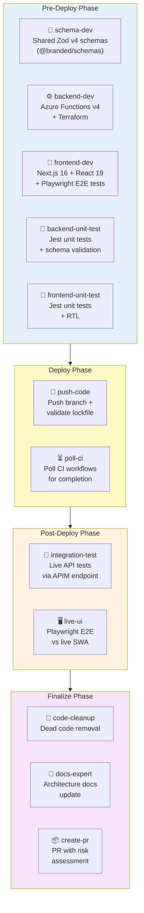
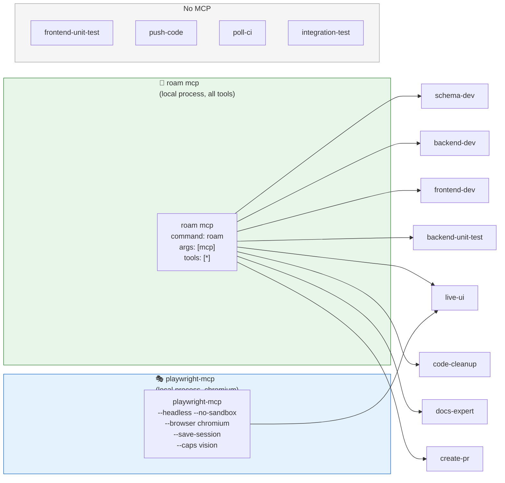
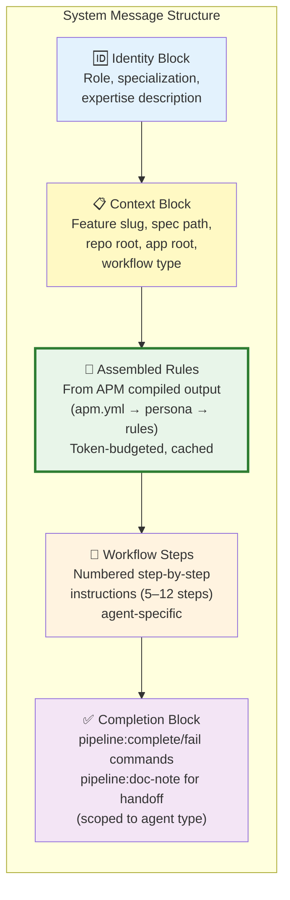
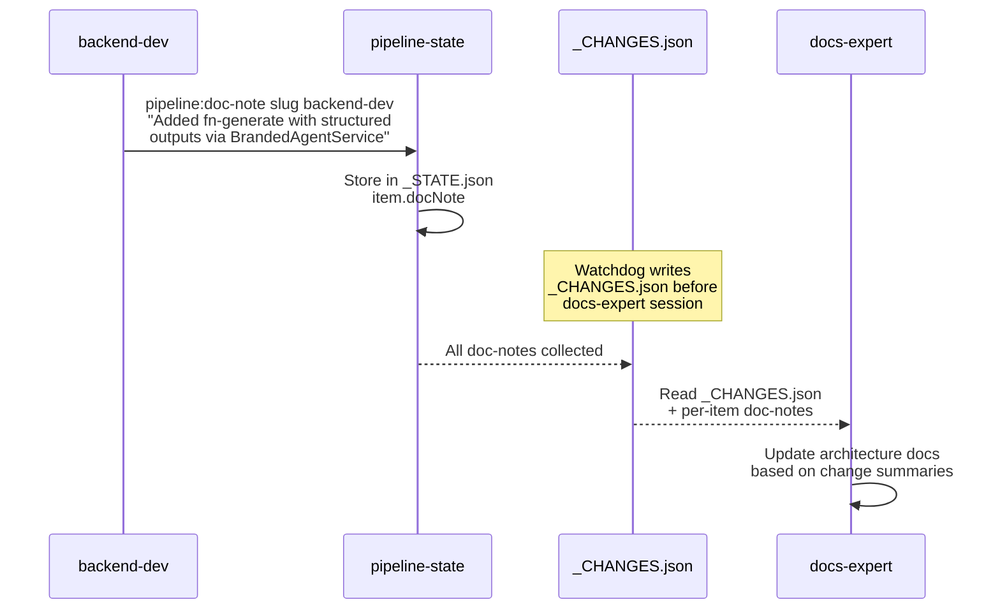
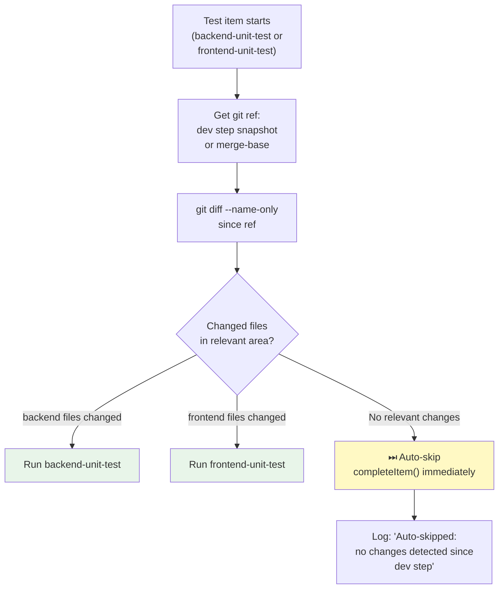
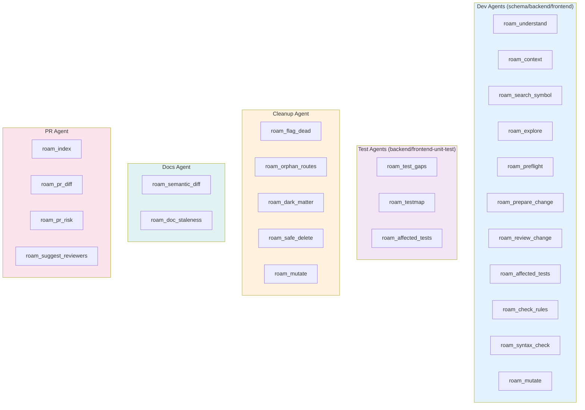
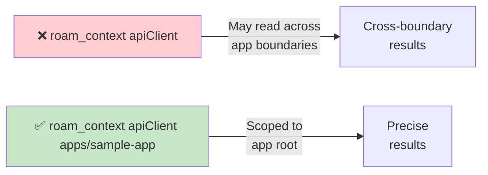

# Specialist Agents — Catalog & Configuration

> 12 specialist agents across 4 phases. Each gets its own Copilot SDK session with tailored prompt, model, and MCP servers.
> Source: `tools/autonomous-factory/src/agents.ts` (~1600 lines)

---

## Agent-to-Phase Map

---

## Agent Capability Matrix

| # | Agent | Phase | MCP Servers | Timeout | Model | Roam Rules |
|---|-------|-------|-------------|---------|-------|------------|
| 1 | `schema-dev` | pre-deploy | roam | 20 min | claude-opus-4.6 | roam-tool-rules |
| 2 | `backend-dev` | pre-deploy | roam | 20 min | claude-opus-4.6 | roam-tool-rules, roam-efficiency |
| 3 | `frontend-dev` | pre-deploy | roam | 20 min | claude-opus-4.6 | roam-tool-rules, roam-efficiency |
| 4 | `backend-unit-test` | pre-deploy | roam | 10 min | claude-opus-4.6 | roam-test-intelligence |
| 5 | `frontend-unit-test` | pre-deploy | — | 10 min | claude-opus-4.6 | roam-test-intelligence |
| 6 | `push-code` | deploy | — | 15 min | claude-opus-4.6 | (always only) |
| 7 | `poll-ci` | deploy | — | 15 min | claude-opus-4.6 | (always only) |
| 8 | `integration-test` | post-deploy | — | 15 min | claude-opus-4.6 | integration-testing |
| 9 | `live-ui` | post-deploy | playwright, roam | 15 min | claude-opus-4.6 | roam-tool-rules, e2e-testing-mandate |
| 10 | `code-cleanup` | finalize | roam | 15 min | claude-opus-4.6 | roam-tool-rules |
| 11 | `docs-expert` | finalize | roam | 15 min | claude-opus-4.6 | roam-tool-rules |
| 12 | `create-pr` | finalize | roam | 15 min | claude-opus-4.6 | roam-tool-rules |

---

## MCP Server Assignments

---

## System Prompt Anatomy

Every agent's system message follows a consistent 5-block structure:

### Example: backend-dev Workflow Steps

| Step | Action |
|------|--------|
| 1 | Read feature spec from `in-progress/` |
| 2 | `roam_understand` — codebase briefing |
| 3 | `roam_context` — locate relevant symbols |
| 4 | `roam_preflight` — blast radius check |
| 5 | Implement changes (Azure Functions + Terraform) |
| 6 | `roam_review_change` — verify impact |
| 7 | Write/update tests |
| 8 | `roam_check_rules` — SEC/PERF/COR/ARCH gate |
| 9 | `agent-commit.sh` — scoped commit |
| 10 | `pipeline:doc-note` — architectural summary for docs-expert |

---

## Doc-Note Handoff Pattern

> Dev agents leave 1–2 sentence architectural summaries via `pipeline:doc-note`. The docs-expert reads all doc-notes via `_CHANGES.json` to update documentation without re-analyzing the entire codebase.

---

## Auto-Skip Optimization

> Auto-skip prevents running test suites when the corresponding dev step made no changes. Detects this via `git diff --name-only` against a per-step snapshot or merge-base ref.

---

## Agent Prompt Builders

| Function | Agent(s) | Key Content |
|----------|----------|-------------|
| `schemaDevPrompt()` | schema-dev | Zod v4 schemas, @branded/schemas, validate:schemas |
| `backendDevPrompt()` | backend-dev | Azure Functions v4, Terraform, BrandedAgentService |
| `frontendDevPrompt()` | frontend-dev | Next.js 16, React 19, Playwright E2E mandate |
| `backendTestPrompt()` | backend-unit-test, integration-test | Jest unit tests (pre-deploy) OR integration tests (post-deploy) |
| `frontendUiTestPrompt()` | frontend-unit-test, live-ui | Jest (pre-deploy) OR Playwright E2E (post-deploy) |
| `deployManagerPrompt()` | push-code, poll-ci | Push branch, validate lockfile, poll CI |
| `codeCleanupPrompt()` | code-cleanup | roam_flag_dead, roam_orphan_routes, roam_dark_matter |
| `docsExpertPrompt()` | docs-expert | _CHANGES.json, doc-notes, architecture docs |
| `prCreatorPrompt()` | create-pr | Risk assessment, change manifest, PR body |

---

## Agent Roam Tool Usage Summary

---

## Monorepo Scoping Rule

> All dev agents must append `${appRoot}` (e.g., `apps/sample-app`) to roam commands to avoid reading symbols from other apps in the monorepo.

---

## Failure Classification Keywords

When post-deploy tests fail, `triageFailure()` in watchdog.ts routes the fix to the right dev agent:

| Keywords | Routes To | Items Reset |
|----------|-----------|-------------|
| `API`, `endpoint`, `500`, `CORS`, `backend`, `function`, `azure` | Backend | backend-dev, backend-unit-test |
| `UI`, `component`, `render`, `frontend`, `page`, `navigation` | Frontend | frontend-dev, frontend-unit-test |
| (structured: `backend+infra`) | Backend layer | backend-dev, backend-unit-test |
| (structured: `frontend+infra`) | Frontend layer | frontend-dev, frontend-unit-test |
| (ambiguous / mixed) | Both | All dev + test items |

---

*← [04 State Machine](04-state-machine.md) · [00 Overview →](00-overview.md)*
